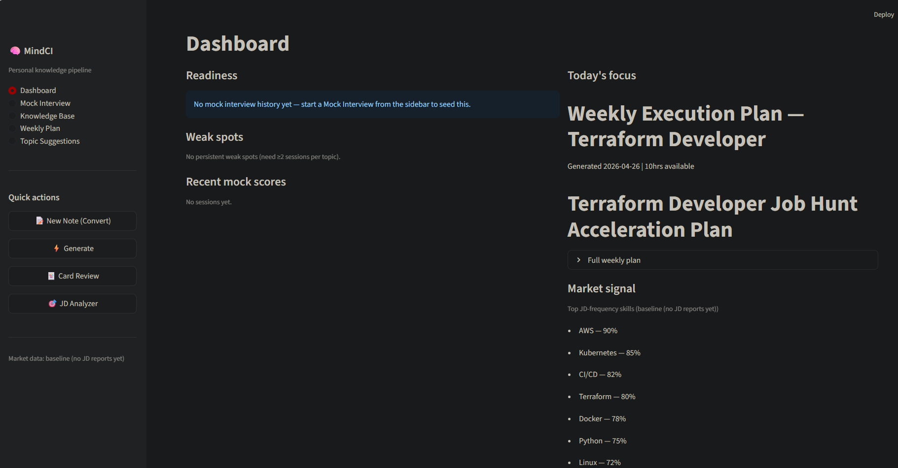

# MindCI

> **New here?** Read [OVERVIEW.md](OVERVIEW.md) first — it's the user-friendly tour. This README is the technical reference.

A personal knowledge pipeline for Cloud Engineers. Converts raw study notes into structured flashcards and interview scenarios, maps your skills against real job descriptions, simulates graded mock interviews, tracks score progression over time, and tells you what to learn next.

---

## Setup




```bash
pip install -r requirements.txt
```

Create a `.env` file in the project root:

```
ANTHROPIC_API_KEY=sk-ant-...
```

`config.py` validates required env vars at import time and fails fast if any are missing. Set `MINDCI_SKIP_ENV_CHECK=1` to bypass the env check for tooling that doesn't need the API key (e.g. `py_compile`, unit tests).

Run the dashboard (recommended):

```bash
streamlit run app_dashboard.py
```

Or in a container:

```bash
docker compose up --build   # then visit http://localhost:8501
```

The app auto-loads your last generated flashcards or scenarios on startup so you can get straight to reviewing.

---

## Project Structure

```
MindCI/
├── app_dashboard.py               # dashboard-first UI (sidebar nav + st.dialog modals)
├── config.py                      # env validation, paths, model + token caps, JD freq loader
├── validation.py                  # Pydantic schemas for all entry types
├── aggregate_jd_frequencies.py    # aggregates saved JD reports into market_frequencies.json
├── utils.py                       # shared file I/O helpers
├── mindci.py                      # argparse CLI: run / convert / generate / aggregate / dashboard
├── run_pipeline.py                # thin alias for `mindci.py run`
├── requirements.txt               # pinned Python deps (incl. pytest)
├── ruff.toml                      # lint config — conservative ruleset
├── Dockerfile                     # python:3.11-slim image, streamlit healthcheck
├── docker-compose.yml             # local container orchestration with volume mounts
├── .dockerignore
├── .pre-commit-config.yaml        # ruff + pytest before every commit
├── .github/workflows/ci.yml       # lint, test, compile-check, smoke-import, docker build on push/PR
├── pipeline/
│   ├── __init__.py
│   ├── _client.py                 # lazy Anthropic client + universal retry + cost telemetry
│   ├── convert.py                 # note → structured JSON, JSON repair, KB versioning
│   ├── generate.py                # flashcard generation, dynamic prompts, batched API calls
│   ├── scenarios.py               # single-file and multi-file scenario generation
│   ├── interview.py               # mock interview grading, pool building, session history
│   ├── jd_analyzer.py             # single and batch JD gap analysis, report saving
│   ├── weekly.py                  # weekly execution plan generation
│   ├── suggestions.py             # topic suggestions, cold-test question generation
│   ├── quality.py                 # CPM markers + cheat sheet, quality scoring, enrichment assistant, live preview
│   ├── calibration.py             # adaptive auto_confidence from rolling interview history
│   ├── weekly_progress.py         # parse `- [ ]` checkboxes from archived weekly plans, persist completion
│   ├── resume_check.py            # diff resume claims (skills/projects/companies) against KB
│   ├── anki_sync.py               # AnkiConnect bridge — push approved cards directly to Anki
│   └── watcher.py                 # debounced raw/ filesystem watcher (used by `mindci watch`)
├── prompts/
│   ├── project.txt
│   ├── cert.txt
│   └── explore.txt
├── reminder_prompts/              # personal Claude-chat templates (gitignored, see Reminder Prompts section)
│   ├── session_debrief.md
│   ├── raw_note_capture.md
│   ├── interview_postmortem.md
│   ├── weak_topic_drill.md
│   └── resume_claim_extraction.md
├── tests/                         # pytest suite (74 tests, runs in <1s)
│   ├── conftest.py                # env stubbing + lazy-client monkeypatch
│   ├── test_client_retry.py
│   ├── test_config.py
│   ├── test_cost_telemetry.py
│   ├── test_jd_parsing.py
│   ├── test_quality.py
│   ├── test_scenarios.py
│   └── test_validation.py
├── raw/           # drop .txt notes here (gitignored)
├── data/          # structured.json, market_frequencies.json, usage.json, history/ (gitignored)
├── jd_reports/    # saved JD reports for frequency aggregation (gitignored)
├── output/        # all generated files (gitignored)
└── archive/       # processed notes moved here (gitignored)
```

The pipeline modules are imported directly by the Streamlit apps and the CLI — no top-level `convert.py` / `generate.py` / `jd_analyze.py` scripts.

---

## Dashboard (`app_dashboard.py`)


**Sidebar nav:** Dashboard · Mock Interview · Knowledge Base · Weekly Plan · Topic Suggestions.
**Quick actions** open as modals: New Note (Convert), Generate, Card Review, JD Analyzer.


### 1. Convert (modal)
Two quality layers before the API call:

**Pre-flight quality check** — rule-based check on raw text. Flags word count, missing confidence/difficulty, root cause language, misleading symptoms, fix documentation, lesson capture. Scored 0-10.

**Note enrichment assistant** — Claude generates 4-5 targeted follow-up questions for thin notes. Answer inline, Claude rewrites the note into a CPM-marked version, one click promotes it to the editor.

After commit, Claude structures notes into `data/structured.json` by type: `project`, `certification`, or `exploration`. Pydantic-validated; invalid entries saved separately to `data/invalid_entries.json`. Defaulted fields surface as warnings. Previous versions of `structured.json` are versioned to `data/history/` (copy-on-write).

**Markdown + frontmatter ingest** — the file uploader accepts both `.txt` and `.md`. If a `.md` file starts with a YAML-style `---` frontmatter block (top-level `key: value` pairs, no nested structures), `pipeline.convert.parse_markdown_with_frontmatter` extracts it and surfaces a "Detected frontmatter" caption. Detected metadata is handed to Claude as a `KNOWN METADATA` hint so pre-known fields (type, confidence, difficulty, etc.) don't get re-inferred and tokens are saved. Drag Obsidian notes in directly — no `.txt` conversion required.

**URL ingest via Jina Reader** — paste a URL (docs page, blog post, AWS announcement) and click *Fetch*. `pipeline.convert.fetch_url_as_markdown` calls the Jina Reader endpoint (`https://r.jina.ai/<URL>`), which strips boilerplate and returns clean LLM-ready markdown. The text auto-populates the Convert text area, then runs through the normal pipeline. Override the reader endpoint with `MINDCI_READER_URL` (point at a self-hosted Trafilatura/Readability service if Jina goes paywalled). Stdlib-only — no new dependency.

### 2. Generate (modal)
Three sub-modes with type and confidence filters:

**Flashcards** — Q&A pairs calibrated to confidence level (High → edge cases, Low → first-principles). Batched 4 entries per API call.

**Scenarios (single file)** — `what_does_this_do`, `whats_wrong`, `fix_it`, `architecture` per entry.

**Scenarios (multi-file)** — 2-3 related files per scenario with realistic filenames. Tests cross-file architecture understanding.

### 3. Card Review (modal)
Approve / reject / skip flow for flashcards (flip mechanic) and scenarios (rendered setup + code + question). Approved → `output/anki.csv`, rejected → `output/anki_rejected.csv`.

**Direct Anki sync via AnkiConnect** — if [AnkiConnect](https://foosoft.net/projects/anki-connect/) is installed and Anki is running, every approved flashcard is pushed straight to your deck (default deck name `MindCI`, override via `MINDCI_ANKI_DECK`). The CSV is still written as a fallback. The probe is one-shot per session, so the dashboard quietly degrades to CSV-only when Anki is closed.

**Code download buttons** — every code/config block in scenarios and mock interview questions gets a `⬇ Download as .X` button beneath it. Heuristic detection picks the right extension (`.tf` for Terraform, `.yaml` for K8s manifests, `.py` for Python, `.json` for JSON, `.txt` fallback) so you can drop it straight into your editor and start hands-on practice.

### 4. JD Analyzer (modal)
**Single** — readiness score 0-100, skill coverage, priority gaps with one-line recommendations, strengths to lead with.

**Batch** — multiple JDs separated by `---` or uploaded as a `.txt`. Aggregate view: most common gaps, consistent strengths, average readiness, best-fit role. Auto-saves to `jd_reports/` and triggers `aggregate_jd_frequencies.py`.

**Three-way bucketing (when a resume is on file).** If `data/resume_claims.json` exists (created via the Resume Check modal), every JD analysis additionally classifies each domain across JD ⨯ Resume ⨯ KB:

- ✅ **Strengths to lead with** — on resume + in KB + on JD. Highest interview leverage.
- 🚩 **Exposures** — on resume + on JD, *not* in KB. You've claimed it; you'll be probed; you can't back it up. The category that ends interviews.
- 💡 **Hidden assets** — in KB + on JD, *not* on resume. You know it but didn't claim it; add it.
- **Priority gaps** — on JD only. True study targets.

The batch analyzer adds a `cross_jd_exposures` field listing claimed-but-unbacked skills that recur across multiple JDs in your active search — those are the highest-priority study targets system-wide. Falls back to the original single-bucket schema when no resume is on file; no behavior change for existing users.

After either mode, if no weekly plan exists for the current ISO week, one is auto-generated from the priority gaps and saved to both `output/weekly_plan.md` (canonical) and `output/weekly_plan_YYYY-WNN.md` (archive).

### 5. Mock Interview (sidebar view)
Multi-step session: question-count slider → per-question UI with setup, code/files, your answer → Claude grades 0-10 with verdict (Strong/Acceptable/Needs Work/Incorrect), what you got right, what you missed, coaching note → end screen with breakdown bars, focus areas, auto-saved to `output/interview_report.json` and appended to history.

In-progress sessions are snapshotted to `output/iv_session.json` after each step, so a refresh / app restart picks up exactly where you left off. The snapshot is removed when the session ends.

After every completed session, `pipeline/calibration.recalibrate_kb()` runs and updates each KB entry's `auto_confidence` from the rolling average of its last 5 attempt scores (skipped answers count as 0). Tier mapping with hysteresis: avg ≥ 8.5 → High, ≥ 6.5 → Medium, < 5.5 → Low; promotions and demotions both require crossing a 0.5-point buffer to avoid flapping. Min 3 attempts before any change. Manual `confidence` is the original seed and is never overwritten — `effective_confidence(entry)` is the single read point that downstream prompts and weighting use, returning auto if set, else manual. The end-of-session screen surfaces a "Calibration update" block with each change.

### 6. Weekly Plan
Reads last JD report, generates a 7-day execution plan for top 2 priority gaps. Per gap: hands-on GitHub project, blog article title, reusable lab exercise, resume bullet, STAR-format interview story. Hours slider before generating.

**Archival + retrospective.** The plan prompt emits each actionable item as a `- [ ]` markdown task list line. The Weekly Plan view has a week selector that lists every archived `weekly_plan_YYYY-WNN.md`; selecting one renders the plan with checkboxes per task. Toggling a checkbox persists to `data/weekly_progress.json` (keyed by week + task index). The header shows `2026-W19 — 4/7 tasks done (57%)` so adherence is visible at a glance.

### 7. Topic Suggestions
Compares KB against market frequency data. Three categories: uncovered high-demand topics, weak-but-in-demand, emerging. **Cold test button** on each item generates 3 questions from the topic name alone — tests whether the gap is knowledge or confidence before committing to a study session.

### 8. Resume Check (modal)
Upload your resume as `.txt` or `.md`. Claude extracts your claimed **skills**, **projects**, and **companies** into `data/resume_claims.json` (one API call, cached). The system then diffs each claim against the current KB — substring match in either direction so `Lambda` matches `AWS Lambda` and vice versa — and groups results into ✅ backed and 🚩 missing per bucket.

The dashboard shows a top-level **Resume reality check** tile: `7/12 claims backed by notes (58%)` with a delta indicator for unbacked claims. Each missing claim gets a one-click **Draft note** button that pre-fills the Convert modal with a starter template, closing the gap loop directly from the report.

Re-checking is free after parsing once — the comparison is local Python with no API calls, so newly-added notes from any Convert run show up on the next render.

### 9. Knowledge Base
Filterable viewer by type and confidence (filter operates on the *effective* confidence — auto if set, else manual). Each entry shows a quality score badge with enrichment suggestions inline; raw JSON expandable. When `auto_confidence` differs from the manual seed, the header surfaces both with an `auto-updated` annotation and a timestamp inside the expander.

**Confidence sparkline** — when an entry has a non-empty `confidence_history`, the expander shows a Unicode block-char sparkline of the last 8 tier transitions plus a textual `Low → Medium → High` trail. Capped at 20 transitions per entry; only appended when a tier actually changes (driven by `pipeline.calibration`).

---

## Cost Telemetry

Every API call goes through `pipeline/_client.call_with_retry`, which records token counts to `data/usage.json` and surfaces them on the dashboard footer:

> API today: **$0.42** (8 calls, 12,304 tokens) · 7-day: **$2.18** (54 calls)

Pricing is configurable via env vars (defaults are placeholders — verify against Anthropic's current list pricing for the active model and override if needed):

```
MINDCI_INPUT_PRICE_PER_MTOK=3.0
MINDCI_OUTPUT_PRICE_PER_MTOK=15.0
```

**Response cache.** Identical `(model, max_tokens, prompt)` calls hit a SHA-256-keyed on-disk cache (`data/response_cache.json`) and skip the API entirely. LRU eviction caps the file at 1,000 entries. Hit/miss counters are tracked in `usage.json` and the dashboard caption shows the live hit rate (e.g. `cache: 47/52 hits (90%)`). Disable per-call with `MINDCI_CACHE_DISABLE=1` for testing or to force a refresh.

---

## Configuration (env vars)

All env-overridable, sensible defaults in `config.py`.

| Variable | Default | Purpose |
|---|---|---|
| `ANTHROPIC_API_KEY` | (required) | Anthropic API auth |
| `MINDCI_SKIP_ENV_CHECK` | unset | Bypass env validation (for `py_compile`, tests) |
| `MINDCI_DATA_DIR` | `data` | Structured KB, history, frequencies, usage log |
| `MINDCI_OUTPUT_DIR` | `output` | Flashcards, scenarios, reports, plans |
| `MINDCI_RAW_DIR` | `raw` | Drop-zone for `.txt` notes |
| `MINDCI_JD_REPORTS_DIR` | `jd_reports` | Saved JD analyses for aggregation |
| `MINDCI_LOG_LEVEL` | `INFO` | stdout log level |
| `MINDCI_MODEL` | `claude-sonnet-4-6` | Anthropic model id used by every call |
| `MINDCI_MAX_TOKENS_GRADE` | `512` | Interview grading + enrichment questions |
| `MINDCI_MAX_TOKENS_REVIEW` | `1024` | Preview, enrichment, rewrite |
| `MINDCI_MAX_TOKENS_ANALYSIS` | `2048` | Gap analysis, suggestions |
| `MINDCI_MAX_TOKENS_BATCH` | `3000` | Batch JD analysis |
| `MINDCI_MAX_TOKENS_GENERATION` | `4096` | Flashcards, scenarios, weekly plan |
| `MINDCI_INPUT_PRICE_PER_MTOK` | `3.0` | USD per million input tokens |
| `MINDCI_OUTPUT_PRICE_PER_MTOK` | `15.0` | USD per million output tokens |
| `MINDCI_CACHE_DISABLE` | unset | Set to bypass the response cache (forces every call through to the API) |
| `MINDCI_MODEL_FAST` | `claude-haiku-4-5-20251001` | Fast/cheap tier used for low-reasoning tasks (resume parsing, enrichment questions, preview) |
| `MINDCI_READER_URL` | `https://r.jina.ai/` | Reader endpoint for URL ingest (override for self-hosted Trafilatura/Readability) |
| `MINDCI_ANKI_URL` | `http://localhost:8765` | AnkiConnect endpoint |
| `MINDCI_ANKI_DECK` | `MindCI` | Deck name approved cards push to |
| `MINDCI_ANKI_MODEL` | `Basic` | Anki note type for pushed cards |

---

## CLI

`mindci.py` is a real argparse CLI that drives the same `pipeline.*` modules the dashboard uses.

```bash
python mindci.py run                  # convert + generate
python mindci.py convert              # raw/*.txt → data/structured.json
python mindci.py generate             # KB → output/anki.csv + questions.md
python mindci.py aggregate            # rebuild data/market_frequencies.json
python mindci.py dashboard            # launch streamlit dashboard
python mindci.py watch                # watch raw/ and auto-convert on file drop
python mindci.py capture "Gotcha: AWS Lambda cold-start circular imports #aws"
                                       # drop a one-liner into raw/ instantly
python mindci.py cache-stats          # show response cache size + hit rate
python mindci.py cache-clear          # delete the response cache file
python mindci.py resume-check         # re-diff saved resume claims against current KB
python mindci.py resume-check --path resume.md  # parse a fresh resume + diff

python mindci.py generate --batch-size 4
python mindci.py convert --no-archive   # leave notes in raw/ instead of archiving
python mindci.py watch --no-archive     # same flag works in watch mode
```

`watch` uses `watchdog` with a 2.5s debounce, so editor "atomic save" sequences trigger only one convert run. Drop a `.txt` into `raw/` from anywhere (Dropbox/Drive sync, mobile shortcut, scp) and it's structured and indexed within seconds.

`capture` pairs with `watch` for terminal-native note-taking. Run `mindci.py capture "your one-liner"` from any shell and it writes a timestamped `capture_YYYYMMDD_HHMMSS.txt` into `raw/`. If `watch` is running in another terminal, the convert pipeline kicks in within seconds. Use `--name <slug>` to set a custom filename instead of the timestamp. Removes the context-switching cost of opening a file or the dashboard mid-task — capture the thought, keep coding.

`run_pipeline.py` is a thin alias for `mindci.py run`.

---

## Tests

```bash
pytest tests/ -v
```

74 deterministic tests, runs in well under a second. Coverage:

- `test_validation.py` — Pydantic schemas, type rejection, normalization, warnings
- `test_quality.py` — note quality scoring, KB entry scoring, type detection
- `test_jd_parsing.py` — single, multi-JD, short-chunk filtering
- `test_config.py` — baseline / blended / live frequency resolution
- `test_scenarios.py` — single + multi-file scenario parsers
- `test_client_retry.py` — success, retry-then-success, exhaustion
- `test_cost_telemetry.py` — usage recording, pricing math, end-to-end via fake client
- `test_calibration.py` — `effective_confidence` precedence, topic matching, hysteresis on each tier transition, min-sample guard, end-to-end recalibration write
- `test_confidence_history.py` — history append on tier change + cap at 20
- `test_markdown_frontmatter.py` — frontmatter extraction (with/without, quoted values, malformed)
- `test_weekly_progress.py` — checklist parser, save/load round-trip, completion stats
- `test_response_cache.py` — hit-skips-API, prompt + max_tokens key isolation, `MINDCI_CACHE_DISABLE` bypass, LRU eviction at cap
- `test_integration_e2e.py` — cassette-style end-to-end: (1) raw note → convert → KB write → generate flashcards → parsable Q/A; (2) build interview pool → score answer → append session → `recalibrate_kb` flips `auto_confidence` Low → High and preserves the manual seed; (3) JD analysis with `resume_claims` includes the resume block in the prompt and returns the four-way bucketing; (4) JD analysis without resume falls back to the original schema
- `test_resume_check.py` — `_kb_candidates` field gathering, substring matching in both directions, coverage bucketing + totals, save/load round-trip
- `test_url_ingest.py` — Jina prefix prepending, `MINDCI_READER_URL` override, empty-body error
- `test_anki_sync.py` — `is_available` true/false paths, `addNote` JSON-RPC payload shape, error-response surfacing
- `test_code_download.py` — language detection (Terraform / YAML / Python / JSON / fallback)
- `test_capture.py` — `mindci.py capture` writes timestamped file, honors `--name`, rejects empty input

`tests/conftest.py` sets `MINDCI_SKIP_ENV_CHECK=1`, a dummy `ANTHROPIC_API_KEY`, redirects `MINDCI_*` paths to a temp directory, and stubs `pipeline._client.get_client` so the suite never touches the network.

---

## CI + pre-commit

`.github/workflows/ci.yml` runs on every push to `main` and every PR: ruff lint, full pytest, `py_compile` on entry points, smoke-import all pipeline modules, and a `docker build` of the image to catch Dockerfile regressions.

`.pre-commit-config.yaml` runs the same checks locally before every commit:

```bash
pip install pre-commit
pre-commit install
```

Lint config in `ruff.toml` — pyflakes + import sorting + common style, ignores tuned to the codebase quirks.

---

## Reminder Prompts

`reminder_prompts/` is a gitignored personal folder for reusable Claude-chat templates — prompts you paste into a fresh Claude conversation when you want a specific kind of output. The dashboard sidebar auto-discovers any `.md` or `.txt` file in the folder and surfaces them in a 📋 Reminder prompts expander; each prompt becomes a tab inside the expander with a built-in copy-to-clipboard button.

Shipped templates (drop in, customize for your workflow):

- **`session_debrief.md`** — paste at the end of a long Claude chat to extract individual CPM-marked study notes covering everything substantive that came up.
- **`raw_note_capture.md`** — paste a rough technical thought; Claude rewrites it as a single CPM-marked note ready for `raw/` ingestion.
- **`interview_postmortem.md`** — after a real or mock interview, capture the highest-signal moment as a structured project entry that will produce good scenarios later.
- **`weak_topic_drill.md`** — Socratic 5-question drill on a topic you're weak in, with calibrated difficulty escalation and a per-question verdict.
- **`resume_claim_extraction.md`** — manual alternative to the Resume Check modal: extracts `{skills, projects, companies}` from a resume in any Claude chat. Output can be saved as `data/resume_claims.json` to feed the dashboard.

Adding more is friction-free: drop a new file into `reminder_prompts/` and it appears as a new tab automatically on the next dashboard render. Filename becomes the tab label (underscores → spaces).

---

## Note Format

Raw `.txt` files can be freeform. The more detail you include, the better the generated scenarios. A note with full root cause, misleading symptoms, and fix produces a more realistic interview scenario than a one-liner.

```
Debugging a circular import error in Lambda when using a shared logger module.
Root cause: logger imported client at module level, client imported logger.
Symptoms: worked locally, failed on cold start in Lambda only.
Fix: lazy import inside the handler function.
Confidence: Medium
Difficulty: Hard
```

### Cognitive Payload Markers (CPM)

A tiny optional vocabulary you can sprinkle into notes so downstream prompts (and the enrichment assistant) know what each line represents. Five markers, no parser required:

```
#tag           keyword / topic, e.g. #kubernetes #etcd
→ step         an ordered step or transition (also accepts ->)
🧠 model       a mental model, framing, or first principle
! gotcha       an error, surprise, or thing that bit you
——SECTION——   optional delimiter between sub-blocks of one note
```

Example:

```
#etcd #raft
——SECTION——
🧠 etcd is just a Raft log with a kv API on top
→ write hits leader → leader replicates to majority → ack
! split-brain shows up when only 2/3 quorum is reachable
```

The full cheat sheet lives in `pipeline/quality.py` (`CPM_CHEAT_SHEET`) and is surfaced inline in the dashboard's enrichment assistant.

---

## Live Market Frequencies

JD Analyzer saves each report to `jd_reports/` and triggers aggregation automatically. After 3 reports, Topic Suggestions switches from hardcoded baseline frequencies to live data derived from your actual job searches. Between 1-2 reports, live and baseline are blended. The active source is always shown in the Topic Suggestions header. Frequencies are reloaded on every dashboard render — new reports take effect without an app restart.

Run aggregation manually at any time:

```bash
python mindci.py aggregate
```

---

## The Feedback Loop

```
raw notes → structured JSON → flashcards + scenarios → mock interview
       ↑              ↑                                       |
topic suggestions     |                                       |
       ↑              auto_confidence (per-entry) ←──── calibration
       |                                                      |
       └─ JD analyzer ← knowledge base ←─────────────────────┘
              ↑
       live JD frequency aggregation
```

Two compounding loops:

- **Outer (market-aware):** JD analyses feed live frequencies → topic suggestions → new notes.
- **Inner (performance-adaptive):** mock interview scores → `auto_confidence` per entry → next Generate run produces flashcards/scenarios calibrated to current ability → next mock interview is harder/easier where it should be.

---

## Output Files

| File | Description |
|---|---|
| `data/structured.json` | Validated knowledge base (entries carry `confidence` seed + `auto_confidence` + `confidence_updated_at` + `confidence_history`) |
| `data/weekly_progress.json` | Per-task completion state for archived weekly plans (`{week: {task_idx: bool}}`) |
| `data/invalid_entries.json` | Entries that failed validation |
| `data/market_frequencies.json` | Aggregated JD skill frequencies |
| `data/usage.json` | Daily API token + cost log + cumulative cache hits/misses |
| `data/response_cache.json` | SHA-256-keyed response cache (LRU, capped at 1,000 entries) |
| `data/resume_claims.json` | Resume-extracted claims (`{skills, projects, companies}`) used by the Resume Check feature |
| `data/history/` | Versioned KB snapshots (copy-on-write) |
| `output/anki.csv` | Approved flashcards for Anki import |
| `output/anki_rejected.csv` | Rejected flashcards |
| `output/questions.md` | Full flashcard question set |
| `output/scenarios.json` | Generated scenario questions |
| `output/interview_report.json` | Last mock interview session |
| `output/interview_history.json` | All session history |
| `output/iv_session.json` | In-progress mock-interview snapshot (refresh-survivable) |
| `output/jd_report.json` | Last JD analysis (single or batch aggregate) |
| `output/weekly_plan.md` | Current canonical study plan |
| `output/weekly_plan_YYYY-WNN.md` | Per-ISO-week plan archive (auto-generated after JD analysis) |
| `jd_reports/` | Individual saved JD reports for aggregation |
